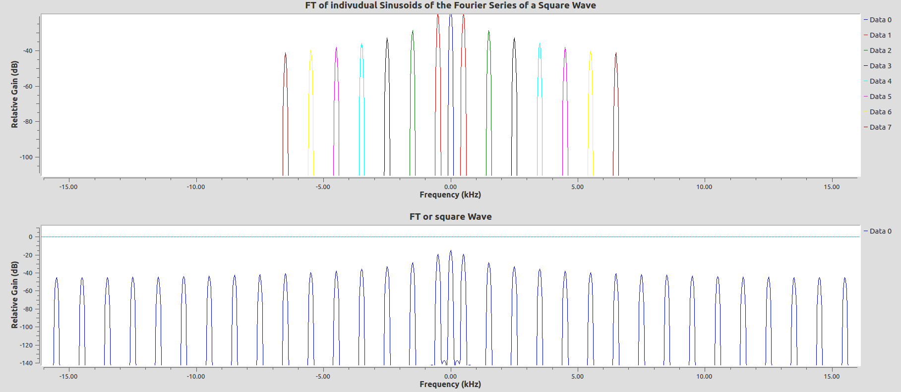

# 3.1. Fourier Series and Fourier Transforms
<!-- TOC -->

- [3.1. Fourier Series and Fourier Transforms](#31-fourier-series-and-fourier-transforms)
    - [3.1.1. Intro](#311-intro)
    - [3.1.2. Fourier Transform](#312-fourier-transform)
    - [3.1.3 Example](#313-example)

<!-- /TOC -->

## 3.1.1. Intro

We segue into the concept of fourier transforms directly by seeing how they relate to fourier series. First some mathematics to associate familiarity, the fourier transform of $$x(t)$$ is given by:

$$
X(\omega) = \int_{-\infty}^{+\infty} x(t) cos(\omega t)dt -i \int_{-\infty}^{+\infty} x(t) sin(\omega t) = \int_{-\infty}^{+\infty}x(t)e^{-i\omega t}dt
$$

When x(t) is periodic and has a fourier series expansion, this integral is pulling out those sines and cosines in the expansion.  

In more detail: For the complex representation of a fourier series of a periodic function $$x(t)$$ :

$$
x(t) = \sum_{-\infty}^{\infty} c_n e^{jn\omega t}
$$

The co-effecients, $$ c_n $$ of $$ x(t) $$ (which  has the period $$ T $$ is given by the relation:

$$
c_n = \frac{1}{T} X(n\omega_o)
$$

where $$X(\omega)$$ is the fourier transform and $$\omega_o = \frac{2\pi}{T}$$

**In summary, the fourier series of a signal is a sum of sines and cosines. And, the fourier transform decomposes the signal into it's its frequency components with their relative strength. This can be visually seen in a neat animation as shown below ( *credit: wikipedia* ) and in the next section**

[↑ Go to the Top of the Page](#)

## 3.1.2. Fourier Transform

Use the [Square Wave](../03/#13-a-sqaure-wave) and the [Triangle Wave](../03/#14-a-triangle-wave) flowgraphs from the previous exercise.

First use a ``signal source`` block to make a square wave and feed the signal into a ``QT frequency sink``

**The Frequency Sink takes the Fourier Transform of the incoming signal and plots the output of the fourier transform**

Place another ``QT Frequency Sink`` and change the number of inputs to the number of fourier series sinusoids you have in your flowgraph and feed all the sinusoids (vis-a-vis the individual fourier series terms) into the frequency sink 

The output looks like this:

The couloured peaks are the Fourier transforms of the individual sinusoids. Do they align with the Fourier Transform of the pure square wave? If you add more terms of the fourier series to the sink, how do they compare?

Repeat this exercise for the triangle wave.

We've been taking fourier transform of the signal everytime we see a plot with frequency in the time axes. 

 We shall visit fourier transforms in detail again that in Lab 5. 

## 3.1.3 Example

We can also think of this to use gnuradio-companion to graphically get the fourier components of a signal using a fourier transform.  Create a flow-graph with a signal source->FFT(fourier transform)-> complex to real/imag -> vector sinks.  The output of the real-part contains the cosine components of the transform.  The imaginary part contains the sine components of the fourier expansion.  

It is also helpful to plot the timeseries to see what your input is and the frequency sink to make it easier to just read off the frequency of the components.  

An example flowgraph looks like:
 

The FFT block is a special block which does the fourier transform really fast. Play around with the FFT block and your general waveform generator from Lab 1 to take their fourier tranform.  Use this to read off the fourier series coefficients.  This can still be used with a periodic signal with much less obvious structure.

[↑ Go to the Top of the Page](#) ......[Next Lab](../04)